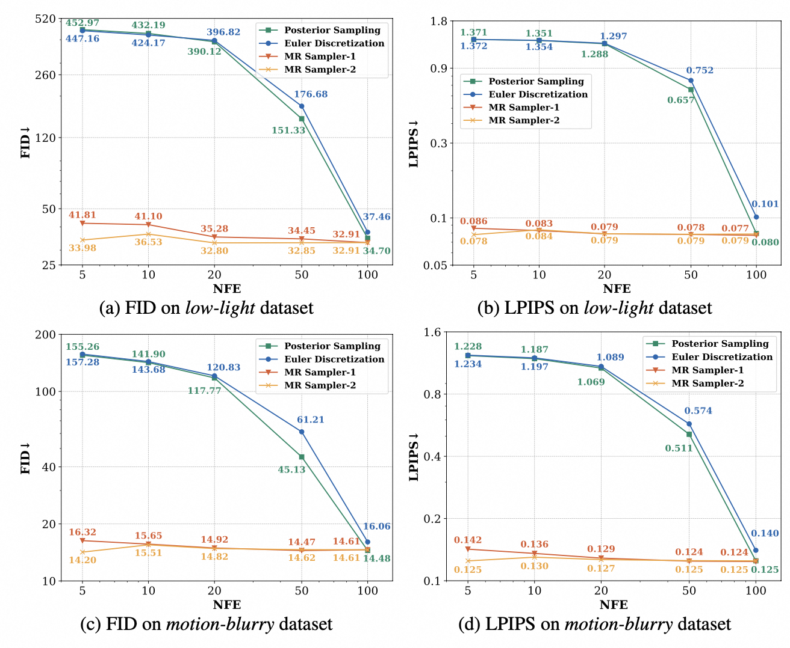
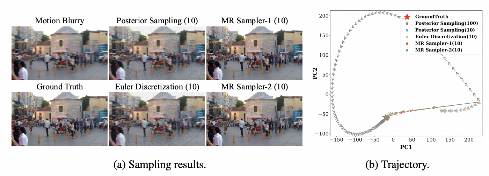

## MRS: A Fast Sampler for Mean Reverting Diffusion Based on ODE and SDE Solvers <br><sub>Official PyTorch Implementation. </sub>

ICLR 2025 Spotlight | [paper](https://arxiv.org/abs/2502.07856)

**Abstract.**
In applications of diffusion models, controllable generation is of practical significance, but is also challenging. Current methods for controllable generation primarily focus on modifying the score function of diffusion models, while Mean Reverting (MR) Diffusion directly modifies the structure of the stochastic differential equation (SDE), making the incorporation of image conditions simpler and more natural. However, current training-free fast samplers are not directly applicable to MR Diffusion. And thus MR Diffusion requires hundreds of NFEs (number of function evaluations) to obtain high-quality samples. In this paper, we propose a new algorithm named MRS (MR Sampler) to reduce the sampling NFEs of MR Diffusion. We solve the reverse-time SDE and the probability flow ordinary differential equation (PF-ODE) associated with MR Diffusion, and derive semi-analytical solutions. The solutions consist of an analytical function and an integral parameterized by a neural network. Based on this solution, we can generate high-quality samples in fewer steps. Our approach does not require training and supports all mainstream parameterizations, including noise prediction, data prediction and velocity prediction. Extensive experiments demonstrate that MR Sampler maintains high sampling quality with a speedup of 10 to 20 times across ten different image restoration tasks. Our algorithm accelerates the sampling procedure of MR Diffusion, making it more practical in controllable generation.


<!-- ### Updates -->


## How to Run the Code?


### Install

create a virtual environment and install packages

```bash
conda create -n mrsde python=3.8 
conda activate mrsde
# pip install torch==2.0.1 torchvision==0.15.2 torchaudio==2.0.2 --index-url https://download.pytorch.org/whl/cu118
pip install -r requirements.txt
```

### Dataset Preparation

Get test datasets from [Google drive](https://drive.google.com/file/d/1JKd1tA7rMoEbI9190daJqL7i6V1L8KUd/view?usp=sharing). Then preparing datasets as follows:

```bash
#### (uncompleted means inpainting) ####
your/path/to/dataset
|--motion-blurry
|  |--LQ/*.png
|  |--GT/*.png
|--hazy
|--jpeg-compressed
|--low-light
|--noisy
|--raindrop
|--rainy
|--shadowed
|--snowy
|--uncompleted
```

Then get into the `universal-image-restoration/config/daclip-sde` directory and modify the dataset paths in option files `options/test.yml`. 

### Pretrained Models

To rigorously validate the effectiveness of our method, we follow the settings and checkpoints from [daclip-uir](https://github.com/Algolzw/daclip-uir) and only modify the sampling part. We use the following pretrained models.

| Model Name   | Description                                     | GoogleDrive                                                                                   | HuggingFace                                                                                      |
|--------------|-------------------------------------------------|------------------------------------------------------------------------------------------------|--------------------------------------------------------------------------------------------------|
| DA-CLIP      | Degradation-aware CLIP model                    | [download](https://drive.google.com/file/d/1A6u4CaVrcpcZckGUNzEXqMF8x_JXsZdX/view?usp=sharing) | [download](https://huggingface.co/weblzw/daclip-uir-ViT-B-32-irsde/blob/main/daclip_ViT-B-32.pt) |
| Universal-IR | DA-CLIP based universal image restoration model | [download](https://drive.google.com/file/d/1eXsyrmAbWOvhIY4Wbt5v4IxaggA5aZMG/view?usp=sharing) | [download](https://huggingface.co/weblzw/daclip-uir-ViT-B-32-irsde/blob/main/universal-ir.pth)   |

Download model weights. Then get into `universal-image-restoration/config/daclip-sde/options/test.yml` and modify `path.pretrain_model_G` and `path.daclip`.

### Evaluation
To evalute our method, remember to modify the parameters in config files like `universal-image-restoration/config/daclip-sde/options/test.yml`.

- `sde.algorithm`: sampling algorithm, choose from [sde, posterior, mrsampler, heun], sde means euler descritization
- `sampler`: parameters for MR Sampler, see annotations of `class MRSampler` in `universal-image-restoration/utils/sampler.py` for details.

| Parameter | Description |
| --------- | ----------- |
| num_sample_steps | number of function evaluations(NFE), proportional to sampling time |
| solver_type | sde or ode |
| parameterization | type of network parameterization, "data" for data prediction or "noise" for noise prediction |
| order | order of algorithm, can be 1 or 2 |
| fit_target | loss type of training, can be "data", "noise", "velocity" |
| lambda_min | clipping threshold for the minimum value of `lambda` for numerical stability |
| time_schedule | time schedule of sampling |
| thresholding | whether to clip output of network at each step, *only* for data prediction |
| threshold_ratio | decide the clipping threshold |
| threshold_max | max threshold |
| denoise_last | whether to denoise to zero at last step |

Run the evaluation as follows:
```bash
cd universal-image-restoration/config/universal-ir
python test.py -opt=options/test.yml
```
We also provide the corresponding parameter collocations of the sampling algorithms compared in the paper, including `posterior.yml`/`euler.yml`/`mrsampler.yml`. Don't forget to modify sampling algorithm, dataset path and sampler config.

### Results

#### Perceptual evaluations on low-light and motion-blurry datasets


#### Sampling trajectory


---

### Acknowledgment
This repository is based on [daclip-uir](https://github.com/Algolzw/daclip-uir). Thanks for their code!


### Citation
If you find the code useful for your research, please consider citing

```
@article{li2025mrs,
  title={MRS: A Fast Sampler for Mean Reverting Diffusion based on ODE and SDE Solvers},
  author={Li, Ao and Fang, Wei and Zhao, Hongbo and Lu, Le and Yang, Ge and Xu, Minfeng},
  journal={arXiv preprint arXiv:2502.07856},
  year={2025}
}
```